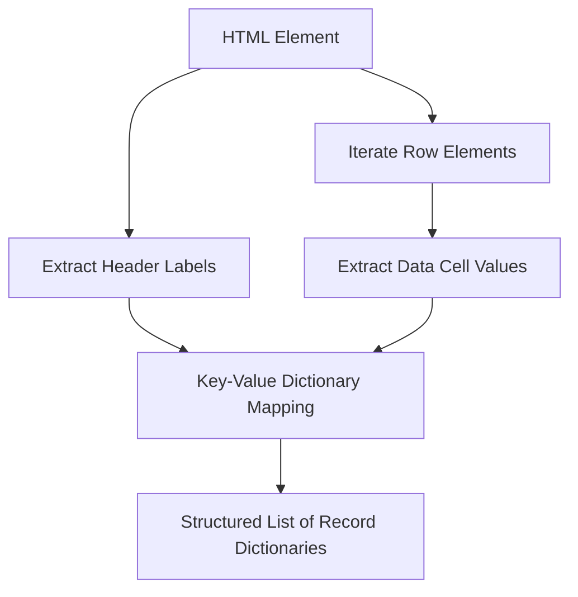

# genpark-web-table-to-structured-json-parser-skill

Agent Skill implementing **HTML Table Matrix Parsing into Structured JSON Objects** in 100% Python standard library.

## Architectural Flow

```mermaid
flowchart TD
    Table["HTML <table> Element"] --> ThScan["Extract <th> Header Labels"]
    Table --> TrScan["Iterate <tr> Row Elements"]
    TrScan --> TdScan["Extract <td> Data Cell Values"]
    ThScan & TdScan --> ZipMap["Key-Value Dictionary Mapping"]
    ZipMap --> JSON["Structured List of Record Dictionaries"]
```
